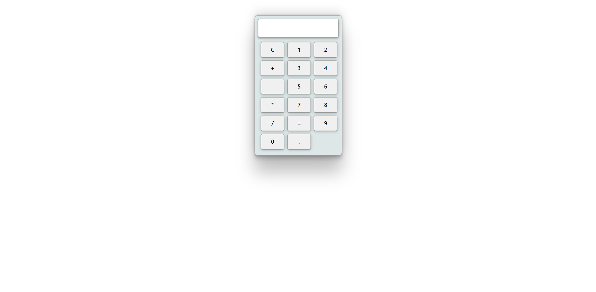
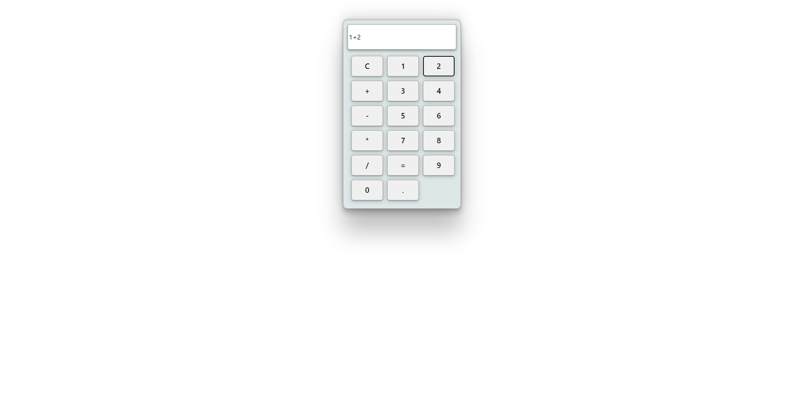
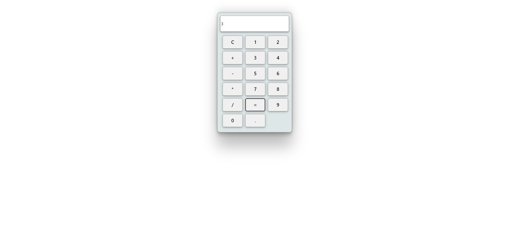

# Simple Calculater

This is simple calculater in React.js for understaing Props and basic hooks.

## DEMO LIVE 

[***Click here***](https://calculater-in-react.onrender.com) to visit the website.

## Usage

## Technologies Used

-Node.js
-React.js

## Author

This Simple Calculater was created by  [Karan Kumar Guatam](https://github.com/KaranGautam0)
